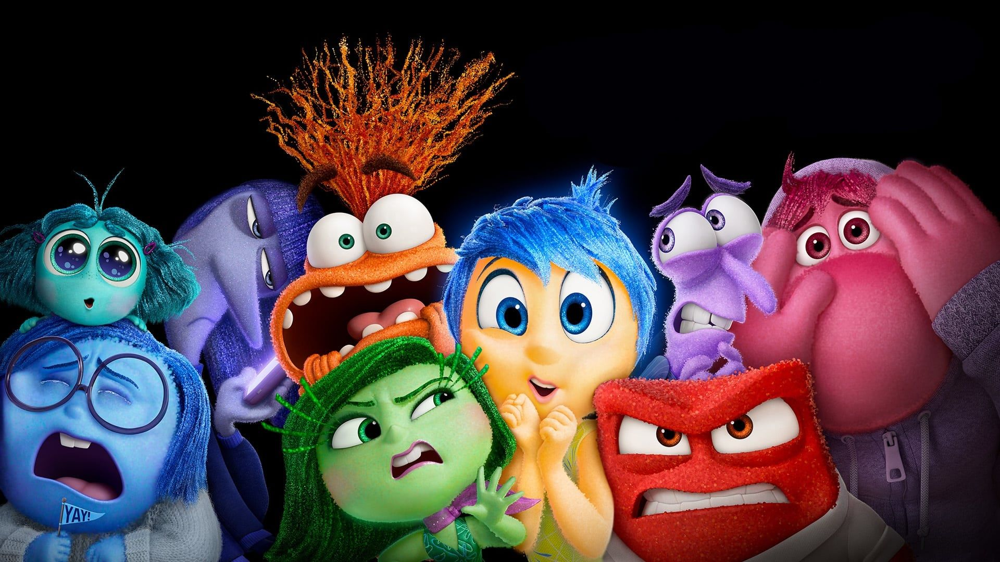

# 🎵 LA BANDA SONORA DE TU VIDA | EXPLORATORY DATA ANALYSIS (EDA) 🎶

## 🔍 TEMA: LA CONEXIÓN ENTRE LA MÚSICA Y LAS EMOCIONES

### 🌟 INTRODUCCIÓN
Cada género musical tiene el poder único de resonar con nuestras emociones. Este EDA explora cómo los diferentes estilos musicales interactúan con nuestros estados emocionales y patrones demográficos. Utilizamos el dataset [Emotify](https://www.kaggle.com/datasets/yash9439/emotify-emotion-classificaiton-in-songs/data) de Kaggle para descubrir patrones ocultos en la relación música-emociones.

---

## 🎯 OBJETIVOS DEL ESTUDIO
1. 🧠 Analizar cómo los distintos géneros musicales afectan las emociones
2. 👥 Entender la relación entre edad de los oyentes y preferencias musicales
3. 🔗 Explorar conexiones entre características musicales y respuestas emocionales

---

## 📌 HIPÓTESIS PRINCIPALES

### 🎸 Hipótesis 1: Emociones Generadas
❔ ¿La música rock genera mayor sensación de energía y exaltación que otros géneros?

### 🎧 Hipótesis 2: Demografía Musical
❔ ¿Los eventos de electrónica atraen público más joven que otros géneros?  
❔ ¿Existe correlación entre edad y preferencia por el rock?

---

## 📊 DATASET OVERVIEW
**Fuente:** [Kaggle - Emotify Dataset](https://www.kaggle.com/datasets/yash9439/emotify-emotion-classificaiton-in-songs/data)  
**Contenido:**
- Géneros musicales
- Características de audio (diferentes emociones, liked/disliked, edad, género, idioma)
- Clasificaciones emocionales
- Datos demográficos de oyentes

---

## 🔑 PRINCIPALES PREGUNTAS DE INVESTIGACIÓN
- 🎭 ¿Qué emociones predominan en cada género musical?
- 📈 ¿Cómo varía la distribución de edades entre géneros?
- 🎛️ ¿Qué características musicales correlacionan con emociones específicas?
- 🎧 ¿Existen diferencias de género en las preferencias musicales?

---

## 🛠️ TECNOLOGÍAS UTILIZADAS
- python y jupiter notebooks
- Librerías: pandas, numpy, matplotlib y seaborn 
